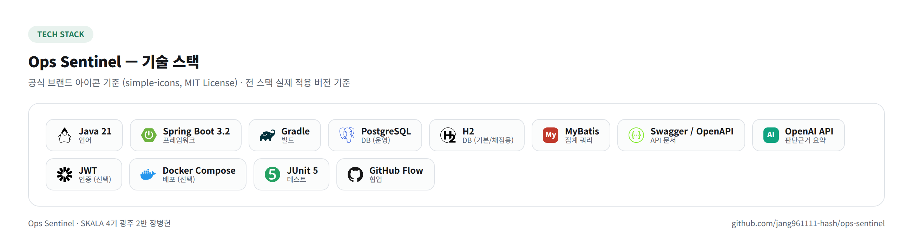
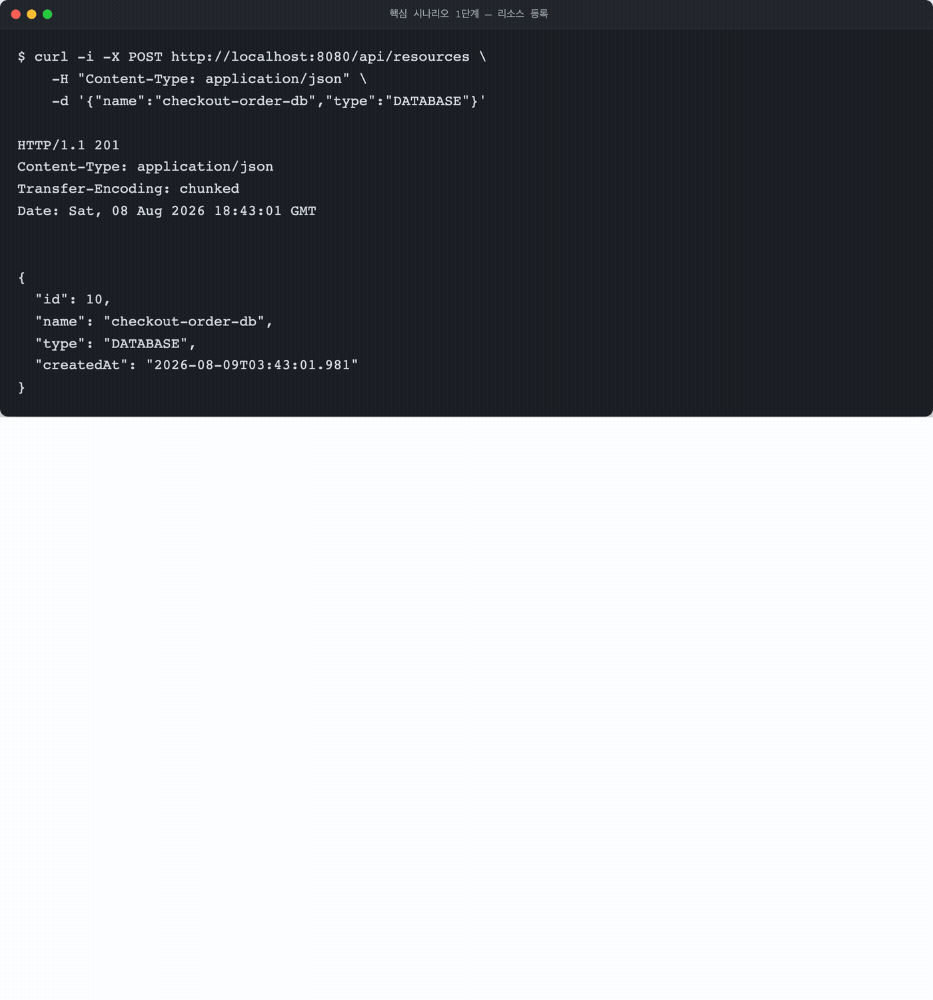
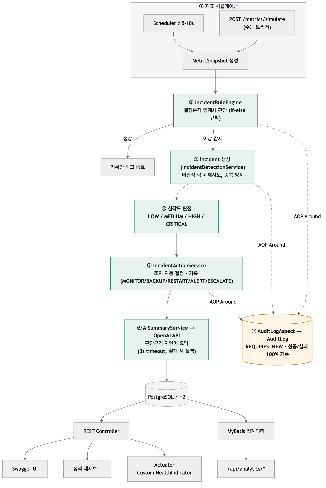
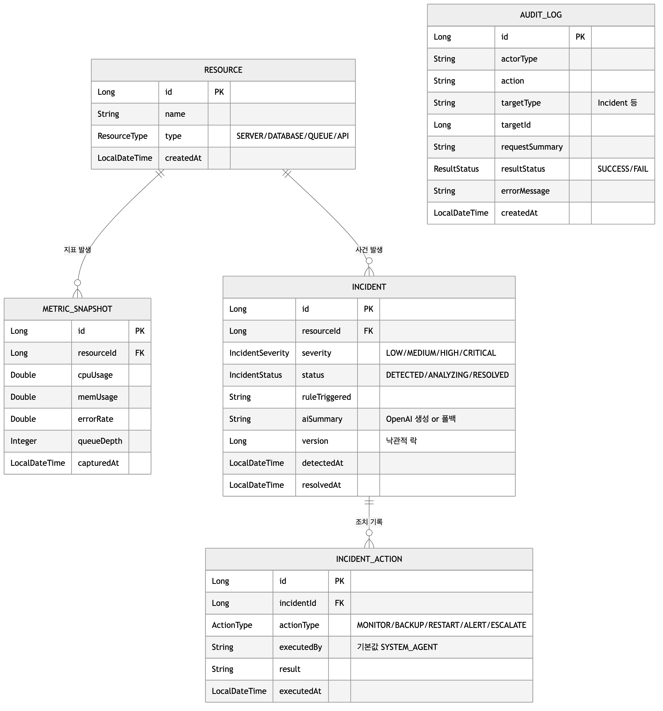
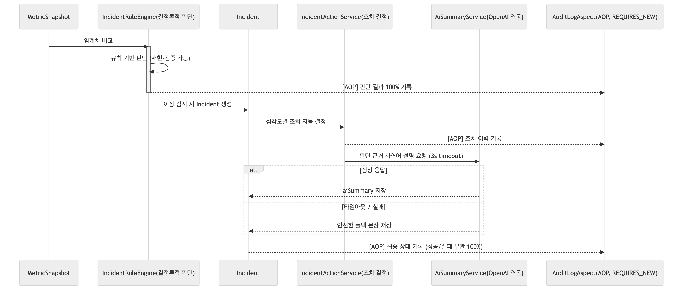
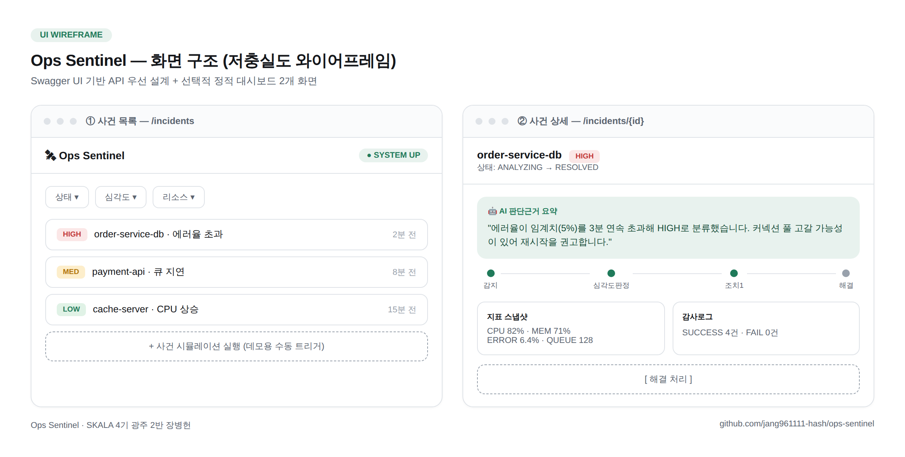
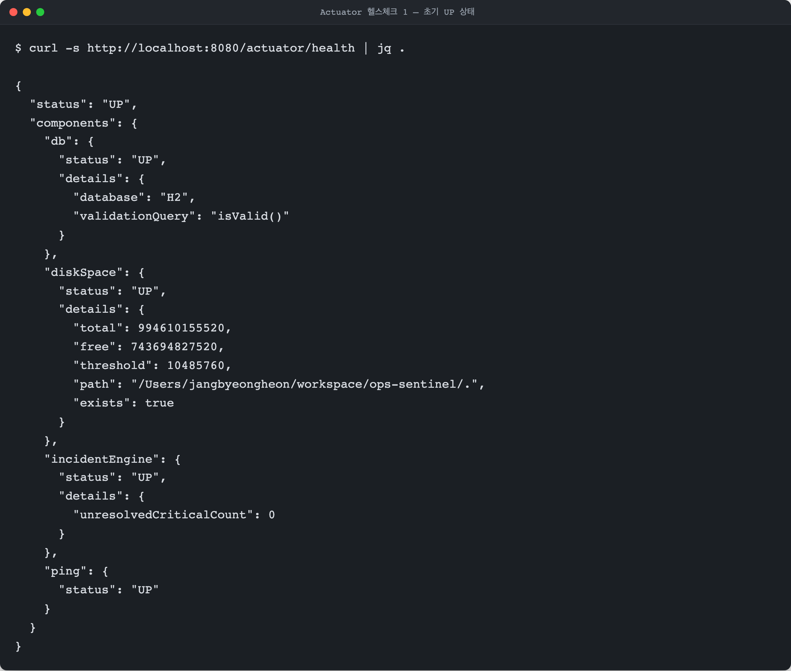
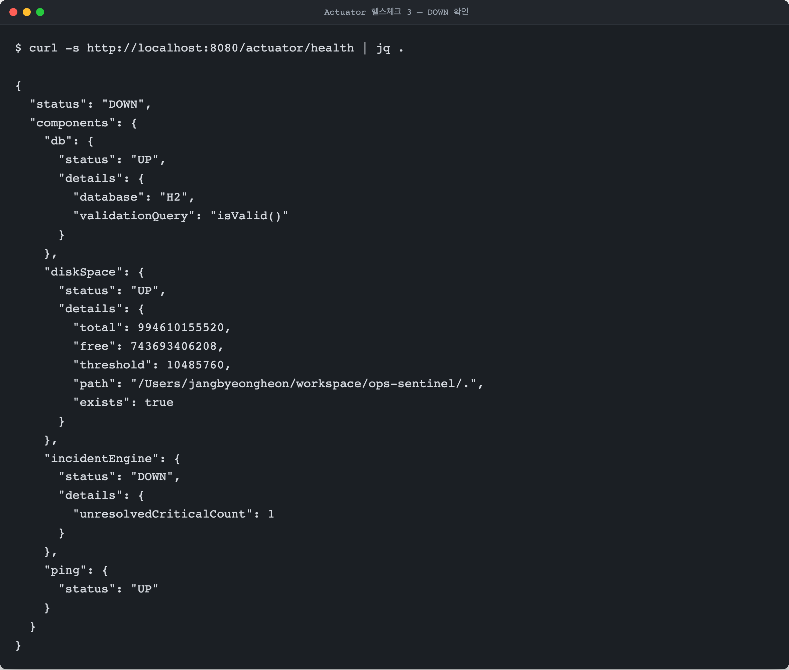
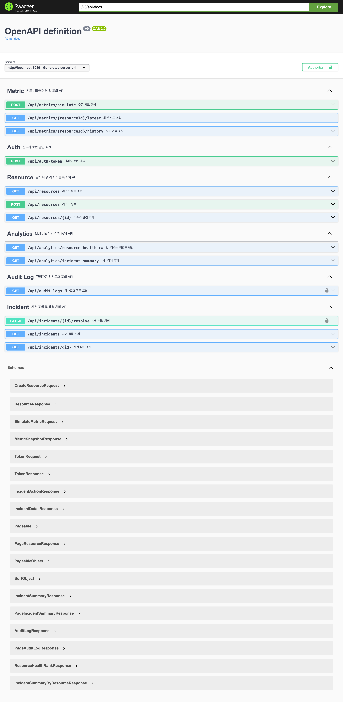
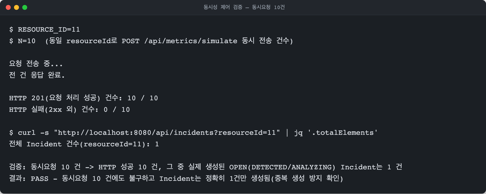

# Ops Sentinel


> 가상 인프라 지표를 감시하다가 이상을 감지하면 스스로 사건을 생성·심각도 판정·조치기록·AI 요약까지 수행하고, 모든 과정을 감사 가능하게 남기는 백엔드 API

SKALA 4기 백엔드 최종 실습 제출물(개인 과제) · Spring Boot 3.3 / Java 21 / Gradle



> 위 이미지의 "Spring Boot 3.2" 표기는 다이어그램 제작 시점의 오기다. 실제 적용 버전은 `build.gradle` 기준 **Spring Boot 3.3.4**다(이 이미지는 mermaid 소스가 없는 HTML 기반이라 텍스트 재렌더링이 어려워, 정정 사실을 이 캡션으로 병기한다). 나머지 스택 표기(Java 21 / Gradle / PostgreSQL / H2 / MyBatis / Swagger·OpenAPI / OpenAI API / JWT / Docker Compose / JUnit 5 / GitHub Flow)는 코드와 대조 검증을 마쳤다.



> 위 GIF는 실제 로컬 서버(`./gradlew bootRun`)에 대한 `curl` 호출 4단계(리소스 등록 → 지표 이상치 주입 → 사건 목록 확인 → 사건 상세의 조치이력·AI 요약 확인)를 그대로 이어붙인 것이다(`docs/pdf/captures/07-scenario-step1~4` 원본 재사용).

---

## 목차
1. [배경](#1-배경)
2. [아키텍처](#2-아키텍처)
3. [핵심 시나리오](#3-핵심-시나리오)
4. [판단(규칙엔진) vs 설명(LLM) 역할 분리](#4-판단규칙엔진-vs-설명llm-역할-분리)
5. [실행 방법](#5-실행-방법)
6. [API 목록](#6-api-목록)
7. [동시성 제어](#7-동시성-제어)
8. [감사로그(AOP)](#8-감사로그aop)
9. [현재 진행 상태](#9-현재-진행-상태)
10. [한계 및 정직하게 밝힐 부분](#10-한계-및-정직하게-밝힐-부분)

---

## 1. 배경

2026년 4월, SK AX는 대신증권과 7년 규모의 계약을 맺고 1단계로 모니터링 에이전트·백업 에이전트·장애/상황관리 에이전트를 금융 인프라 운영에 투입했다. 핵심은 사람이 로그를 뒤져 사후에 원인을 찾는 방식이 아니라, 시스템이 이상 징후를 선제적으로 탐지·분석·판단하고 조치까지 수행하는 에이전틱 AIOps 구조로 운영 패러다임을 전환한 것이다. **Ops Sentinel은 이 사례가 제시하는 "지표 감시 → 이상탐지 → 판단 → 조치 → 감사"라는 개념적 파이프라인을, 개인 백엔드 과제로 소화 가능한 스케일로 축소 구현한 프로젝트다.** 실제 물리 인프라 대신 시뮬레이션 지표를 사용하고, 판단은 학습 모델이 아닌 규칙 기반 엔진이 맡으며, LLM은 그 판단을 사람이 읽을 수 있는 자연어로 설명하는 보조 역할에 한정한다. 화려한 기능 나열보다 "왜 이런 판단을 내렸는지 사람이 사후에 검증할 수 있는가"라는 감사 가능성(auditability)에 설계의 무게중심을 두었다.

이 배경 설명과 설계 결정의 근거는 학술 논문·업계 표준 문서·언론 보도로 교차검증했다(자세한 출처와 비판적 평가는 `docs/07_배경조사_근거자료집.md` 참고).

| 우리 프로젝트의 설계 | 근거 출처 |
|---|---|
| 지표(CPU/메모리/에러율/큐길이) 수집 구조 | Google SRE Book, Four Golden Signals |
| 이상탐지 → 근본원인 → 자동조치 파이프라인 | 베이징대 AIOps 서베이 논문(arXiv:2406.11213) |
| 규칙기반 판단 + LLM은 설명만 담당 | FINOS AI 거버넌스 프레임워크, Tier 2 감사 요구사항 |
| OpenAI 실패 시 폴백 처리 | Zalando Engineering Blog, AI 사후분석 2년 운영 사례의 한계 인정 |
| 전체 기획 동기 | SK AX × 대신증권 7년 계약(2026.4) |

## 2. 아키텍처



> 클래스명(`IncidentRuleEngine`, `IncidentDetectionService`, `IncidentActionService`, `AiSummaryService`, `AuditLogAspect`)과 락 방식(비관적 락)까지 실제 소스와 대조해 반영한 다이어그램이다(`docs/images/source/architecture.mmd`).

### 2-1. 왜 모듈러 모놀리식인가 (ADR 요약)

| 옵션 | 채택 여부 | 근거 |
|---|---|---|
| **모듈러 모놀리식**(도메인별 패키지 분리, 단일 배포단위) | ✅ 채택 | 혼자·제한된 시간 안에 완성해야 하는 조건에서 서비스 간 통신·분산 트랜잭션 문제 없이도 "구조가 잘 나뉘어 있다"는 신호를 줄 수 있는 현실적인 선택 |
| MSA(서비스 완전 분리) | ❌ 기각 | 서비스 간 통신·분산 트랜잭션·배포 파이프라인까지 혼자 감당하기엔 리스크 대비 이득이 작음 |
| 단순 레이어드 모놀리식(도메인 구분 없이 Controller/Service/Repository만) | ❌ 기각 | 도메인 경계가 드러나지 않아 구조적 차별점이 없음 |

### 2-2. 패키지 구조

도메인별로 패키지를 나누고, 각 도메인 내부는 다시 `web(Controller) / service / repository / entity` 계층으로 분리했다. 도메인 간에는 직접 참조를 최소화해, 필요해지면 패키지 단위로 서비스를 쪼개기 쉬운 형태를 유지한다.

```
src/main/java/com/opssentinel
├── resource   # 인프라 리소스(서버/DB/큐/API) 등록·조회
├── metric     # 지표 시뮬레이션·조회
├── incident   # 이상탐지 규칙엔진, 사건 생성·조회·해결, 커스텀 헬스 인디케이터
├── audit      # AOP 감사로그(@Auditable, Aspect, Recorder)
├── analytics  # MyBatis 기반 집계 API
└── common     # 전역 예외처리, 공통 응답 DTO
```

### 2-3. JPA(CRUD) + MyBatis(집계) 역할 분리

- 단건 CRUD, 상태 전이, 락이 필요한 조회(`SELECT ... FOR UPDATE`)는 **Spring Data JPA**로 처리한다. `Resource`, `MetricSnapshot`, `Incident`, `IncidentAction`, `AuditLog` 5개 엔티티가 대상이다.
- 여러 테이블을 JOIN하고 `GROUP BY`, `CASE`, `AVG` 등으로 집계해야 하는 통계성 조회(`/api/analytics/*`)는 **MyBatis**(`AnalyticsMapper.xml`)로 순수 SQL을 직접 작성한다. JPA로도 구현할 수는 있지만, 다중 테이블 집계를 억지로 JPQL/Criteria로 표현하면 가독성이 떨어지고 실행 계획을 예측하기 어려워지므로 역할을 명확히 나눴다.

### 2-4. 데이터 모델 (ERD)



실제 엔티티 클래스(`Resource`, `MetricSnapshot`, `Incident`, `IncidentAction`, `AuditLog`)의 필드명·타입·Enum 값을 한 줄씩 대조해 작성했다(`docs/images/source/erd.mmd`).

## 3. 핵심 시나리오

```
운영자                 스케줄러/API              규칙엔진               Incident/Action           AOP 감사로그
  |                        |                       |                        |                        |
  | 리소스 등록 -----------> POST /api/resources    |                        |                        |
  |                        |                       |                        |                        |
  |                 (7초 주기) 지표 시뮬레이션 생성   |                        |                        |
  |                 or POST /api/metrics/simulate ->|                        |                        |
  |                        |                       |                        |                        |
  |                        |  임계치 초과 판단 ----->| Resource 행 비관적 락  |                        |
  |                        |                       | -> OPEN 사건 존재? ---> | 없으면 Incident 생성    |
  |                        |                       |                        | -> 조치(Action) 자동기록|
  |                        |                       |                        |                        |
  |                        |                       |          모든 단계  --------------------------->| AuditLog 기록
  |                        |                       |          (성공/실패 무관, REQUIRES_NEW)          | (SUCCESS/FAIL)
  |                        |                       |                        |                        |
  | GET /api/incidents/{id} 조회 (조치이력 포함) <----------------------------                        |
  | PATCH /resolve 처리 ------------------------------------------------->|                        |
```

1. 운영자가 `POST /api/resources`로 서버/DB/큐/API 타입 리소스를 등록한다.
2. `@Scheduled(fixedRate=7000)` 스케줄러가 등록된 리소스 전체에 랜덤 지표(CPU/메모리/에러율/큐길이)를 생성한다. 약 10% 확률로 임계치를 넘는 이상치를 섞어 규칙엔진이 자연스럽게 트리거되도록 했다. `POST /api/metrics/simulate`로 수동 트리거도 가능하다(데모용).
3. `IncidentRuleEngine`이 지표를 검사해 임계치 초과 여부와 심각도를 판정하고, `IncidentDetectionService`가 Resource 행에 비관적 락을 건 뒤 중복 여부를 확인해 `Incident`를 생성한다.
4. `IncidentActionService`가 심각도와 트리거된 규칙에 따라 조치(MONITOR/ALERT/RESTART/BACKUP/ESCALATE 조합)를 자동 결정·기록하고 상태를 `DETECTED → ANALYZING`으로 전이한다.
5. `AiSummaryService`가 OpenAI API(`gpt-4o-mini`)로 "왜 이 조치를 했는지" 1~2문장 자연어 요약을 생성해 `aiSummary`에 저장한다. `OPENAI_API_KEY`가 없거나 호출이 실패/타임아웃(3초)되면 예외를 흡수하고 기본 템플릿 문장으로 대체해 전체 흐름을 막지 않는다.
6. 위 모든 단계는 `@Auditable` + AOP `@Around`가 가로채 `AuditLog`에 성공/실패 여부와 함께 100% 기록한다.
7. 운영자는 `GET /api/incidents`, `GET /api/incidents/{id}`, `GET /api/analytics/*`로 사건과 통계를 조회하고, 처리가 끝난 사건은 `PATCH /api/incidents/{id}/resolve`로 종료 처리한다(재해결 요청은 멱등하게 무시되어 최초 resolvedAt이 유지된다). 이 두 관리자 전용 엔드포인트(`GET /api/audit-logs`, `PATCH /api/incidents/{id}/resolve`)는 `POST /api/auth/token`으로 발급받은 JWT(`Authorization: Bearer`)가 있어야 호출할 수 있다.

## 4. 판단(규칙엔진) vs 설명(LLM) 역할 분리



이 프로젝트에서 **"판단"은 전적으로 규칙 기반 엔진(`IncidentRuleEngine`)이 담당한다.** 지표가 임계치(예: 에러율 5% 이상, CPU 90% 이상)를 넘었는지, 심각도를 LOW/MEDIUM/HIGH/CRITICAL 중 무엇으로 매길지, 어떤 조치(MONITOR/ALERT/RESTART/BACKUP/ESCALATE)를 취할지는 모두 if-else 기반 규칙으로 결정되며 결정론적이고 재현 가능하다.

LLM(OpenAI API)은 이 판단 자체를 바꾸지 않는다. 규칙엔진이 이미 내린 결정을 사람이 읽기 쉬운 자연어 1~2문장으로 사후 설명하는 역할만 맡으며, API 호출이 실패하거나 타임아웃(3초)이 발생해도 미리 정의한 폴백 문장으로 대체되어 전체 흐름을 막지 않는다.

이렇게 역할을 나눈 이유는 "이게 진짜 AI냐"는 과장 논란을 피하기 위해서다. 판단 로직을 LLM에 맡기면 설명력과 재현성이 떨어지고 테스트도 어려워진다. FINOS(Fintech Open Source Foundation)의 AI 거버넌스 프레임워크가 제시하는 감사 요구사항 중 "Tier 2: 명시적 추론이 도구 호출 전에 생성·기록되어야 하며 자연어 설명을 포함해야 한다"는 원칙과도 맞닿아 있다. 즉 규칙엔진의 결정(Decision)이 먼저이고, LLM의 설명(Explanation)은 그 뒤를 따르는 부가 정보라는 순서를 지킨다.

> **현재 구현 상태**: 규칙엔진 기반 판단·조치기록에 이어 OpenAI 연동(`aiSummary` 자동 생성)까지 실제로 라이브 동작 중이다. `Incident.aiSummary`는 실제 LLM이 생성한 자연어 문장이 채워지며, `OPENAI_API_KEY`를 설정하지 않았거나 호출이 실패/타임아웃되는 경우에만 미리 정의한 폴백 문장으로 대체된다(판단 로직 자체는 절대 LLM에 넘기지 않는다는 원칙은 그대로 유지).

## 5. 실행 방법

### 요구 사항
- JDK 21
- 별도 DB 설치 불필요 — H2 인메모리 DB를 기본으로 사용

### 빌드 및 실행

```bash
# 빌드(테스트 포함)
./gradlew build

# 서버 실행 (기본 포트 8080)
./gradlew bootRun
```

### H2 콘솔 접속

1. 서버 실행 후 브라우저에서 `http://localhost:8080/h2-console` 접속
2. JDBC URL: `jdbc:h2:mem:opssentinel` / Username: `sa` / Password: (공백)

### (선택, 검증됨) Docker Compose로 한 번에 실행 — app + PostgreSQL

Gradle 로컬 실행 대신, PostgreSQL까지 포함해 컨테이너로 한 번에 띄우고 싶다면:

```bash
# 1) 환경변수 파일 준비 (DB_PASSWORD 등 값 채우기)
cp .env.example .env

# 2) app(Dockerfile 빌드) + postgres 함께 기동
docker compose up -d --build

# 3) 종료
docker compose down
```

- app 컨테이너는 `SPRING_PROFILES_ACTIVE=docker`로 뜨며 `application-docker.yml`(PostgreSQL 접속 설정)을 사용한다. 기본 프로필(H2)과는 완전히 분리되어 있어 `./gradlew test` 등 기존 H2 기반 테스트에는 영향이 없다.
- postgres 컨테이너의 healthcheck를 통과한 뒤에야 app이 기동된다(`depends_on: condition: service_healthy`).
- 데이터는 `postgres-data` 볼륨에 영속화되어 `docker compose down` 후에도 유지된다(볼륨까지 지우려면 `docker compose down -v`).
- 기동 후 접속 경로는 아래 Gradle 실행과 동일하다(`http://localhost:8080/...`).
- US-024(2026-08-09) 재검증: `docker compose up -d --build`로 app+postgres 정상 기동, `GET /actuator/health`에서 `db` 컴포넌트가 `PostgreSQL`로, `incidentEngine`이 `UP`으로 확인됐다(최신 동시성 수정·HikariCP pool=60 반영 상태 기준).

### Swagger UI

`http://localhost:8080/swagger-ui/index.html` — 전체 API를 문서화된 형태로 확인하고 직접 호출해볼 수 있다.

### 대시보드

`http://localhost:8080/dashboard.html` — Swagger 대신 최근 사건 목록과 리소스 위험도 랭킹을 바로 볼 수 있는 정적 페이지(vanilla JS, 인증 불필요).

### 화면 구성 (와이어프레임)



### 헬스체크

`http://localhost:8080/actuator/health` — 기본 헬스체크. 하위 컴포넌트 상세는 `show-details: always` 설정으로 함께 노출된다(예: `/actuator/health` 응답 안의 `incidentEngine` 컴포넌트).

CRITICAL 등급의 미해결 사건이 있으면 `incidentEngine` 컴포넌트가 DOWN으로 바뀌고, 해결(resolve) 처리하면 다시 UP으로 돌아온다 — 실제 로컬 서버로 재현한 캡처:

| ① 초기 UP | ② CRITICAL 발생 → DOWN | ③ resolve 처리 → 다시 UP |
|---|---|---|
|  |  |  |

## 6. API 목록



`🔒`가 붙은 엔드포인트는 관리자 전용이다 — 먼저 `POST /api/auth/token`으로 JWT를 발급받아
`Authorization: Bearer <token>` 헤더에 실어 호출해야 하며, 없거나 유효하지 않으면 401을 응답한다.

### Auth

| Method | Path | 설명 |
|---|---|---|
| POST | `/api/auth/token` | 고정 admin 계정(`admin.password`, 기본값 `admin1234`) 검증 후 JWT 발급 |

### Resource

| Method | Path | 설명 |
|---|---|---|
| POST | `/api/resources` | 리소스 등록(`{name, type}`, type: `SERVER/DATABASE/QUEUE/API`) |
| GET | `/api/resources` | 리소스 목록 조회 (필터: `type`, 페이징) |
| GET | `/api/resources/{id}` | 리소스 단건 조회 |

### Metric

| Method | Path | 설명 |
|---|---|---|
| POST | `/api/metrics/simulate` | 수동 지표 생성(데모용, 필드 미지정 시 랜덤 값) |
| GET | `/api/metrics/{resourceId}/latest` | 최신 지표 조회 |
| GET | `/api/metrics/{resourceId}/history` | 지표 이력 조회(`from`, `to`) |

### Incident

| Method | Path | 설명 |
|---|---|---|
| GET | `/api/incidents` | 사건 목록 조회 (필터: `status`, `severity`, `resourceId`, 페이징) |
| GET | `/api/incidents/{id}` | 사건 상세 조회(조치 이력 + AI 요약 포함) |
| PATCH | `/api/incidents/{id}/resolve` | 🔒 사건 해결 처리(멱등 — 이미 RESOLVED면 resolvedAt을 재설정하지 않음) |

### Analytics (MyBatis 집계)

| Method | Path | 설명 |
|---|---|---|
| GET | `/api/analytics/incident-summary` | 리소스별 사건 건수·심각도 분포·평균 해결시간(분) 집계 (`from`/`to` 기간 필터 optional) |
| GET | `/api/analytics/resource-health-rank` | 사건 발생 빈도 기준 리소스 위험도 랭킹(사건 없는 리소스도 0건으로 포함) |

### Audit Log

| Method | Path | 설명 |
|---|---|---|
| GET | `/api/audit-logs` | 🔒 전체 감사로그 조회 (필터: `actorType`, `resultStatus`, `targetType`, 페이징) |

### Actuator

| Path | 설명 |
|---|---|
| `/actuator/health` | 기본 헬스체크 |
| `/actuator/health/incidentEngine` | 커스텀: 최근 5분 내 감지되고 미해결(RESOLVED 아님)인 CRITICAL 사건이 있으면 DOWN |

### 공통 에러 응답

| 코드 | 상황 |
|---|---|
| 400 | 잘못된 요청 파라미터/검증 실패/깨진 JSON 본문/정의되지 않은 enum 값 |
| 401 | 🔒 엔드포인트에 토큰 없이 접근했거나 토큰이 유효하지 않음/만료됨 |
| 404 | 존재하지 않는 리소스/사건, 혹은 존재하지 않는 경로 |
| 405 | 해당 경로가 지원하지 않는 HTTP 메서드로 호출됨 |
| 409 | 동시성 충돌(중복 사건 생성 시도 등) |
| 500 | 서버 내부 오류 |

모든 에러 응답은 `{timestamp, status, error, message, path}` 공통 포맷을 따른다. Spring MVC가
컨트롤러 진입 전에 자체적으로 던지는 프레임워크 예외(깨진 JSON, 지원하지 않는 메서드, 존재하지
않는 경로 등)도 `GlobalExceptionHandler`(`ResponseEntityExceptionHandler` 상속)가 가로채 같은
포맷으로 응답하므로, 이런 경우에도 500이 아니라 위 표의 알맞은 코드로 응답한다.

## 7. 동시성 제어

**"동일 리소스에 중복 사건이 생성되지 않는다"**는 이 프로젝트의 핵심 동시성 제어 지점이다. 동일 `resourceId`에 여러 요청이 거의 동시에 임계치 초과 지표를 만들어내면, 각 요청 스레드가 동시에 "OPEN 사건이 있는지 조회 → 없으면 새로 생성"하는 임계구간에 진입할 수 있고, 이 경우 조회 시점에는 둘 다 "OPEN 사건 없음"으로 판단해 중복 Incident가 생성될 수 있다.

`IncidentDetectionService`는 이 임계구간을 **동일 `resourceId`의 `Resource` 행에 대한 비관적 락(`SELECT ... FOR UPDATE`)**으로 직렬화해서 막는다. 락을 획득한 스레드만 "OPEN 사건 조회 → 없으면 생성"을 수행하고, 나머지 스레드는 락이 풀릴 때까지 대기했다가 순차적으로 같은 검사를 반복하므로 중복 생성이 발생하지 않는다. 락 타임아웃 등 예외 상황에 대비해 최대 3회까지 재시도하며, 재시도가 모두 소진되면 `ConflictException`(409)으로 응답한다.

애초 계획은 `Incident.version` 필드를 이용한 낙관적 락이었지만, 다음 이유로 비관적 락으로 전환했다.
- H2가 부분 unique 인덱스(`resourceId + status=OPEN`)를 지원하지 않아 DB 제약만으로는 중복을 막을 수 없었다.
- `Incident.version`에 거는 낙관적 락은 이미 존재하는 같은 row를 다시 쓸 때만 충돌을 감지할 뿐, **서로 다른 두 개의 새 row가 동시에 insert되는 상황 자체는 막지 못한다** — 애초에 검사 시점에 "OPEN 사건이 없다"고 두 스레드가 동시에 판단하기 때문이다.

이 때문에 검사와 생성을 감싸는 임계구간 자체를 Resource 행 락으로 직렬화하는 방식을 채택했다.

### 실측 검증

동일 `resourceId`로 `POST /api/metrics/simulate` 10건을 동시에 보내도 HTTP 201은 10건 모두 성공하지만, 실제 생성된 OPEN(DETECTED/ANALYZING) Incident는 정확히 1건만 남는다:



## 8. 감사로그(AOP)

모든 처리 결과(성공/실패 무관)를 사람이 사후에 검증할 수 있도록 `AuditLog`에 남긴다. 이를 위해 도메인 서비스 코드 안에 로깅 코드를 직접 흩뿌리지 않고, `@Auditable` 커스텀 애노테이션 + AOP `@Around` 어드바이스(`AuditLogAspect`)로 관심사를 분리했다.

- `@Auditable`이 붙은 메서드(`MetricService.simulate`, `IncidentDetectionService.detectAndCreate`, `IncidentActionService.decideAndRecord`, `IncidentQueryService.resolve`)의 호출을 `AuditLogAspect`가 가로챈다.
- 대상 메서드가 정상 반환하면 `AuditLogRecorder.recordSuccess(...)`를, 예외를 던지면 `recordFailure(...)`를 호출해 `AuditLog`를 저장한다. 이때 원래 예외는 그대로 다시 던져(rethrow) 호출자(컨트롤러 등)의 정상적인 에러 처리 흐름을 막지 않는다. `AuditLogAspect`가 이 호출 자체를 try-catch로 한 번 더 감싸므로, 감사로그 저장(REQUIRES_NEW 트랜잭션)이 커넥션풀 고갈 등으로 자체 실패하더라도 그 실패가 원래 예외를 덮어쓰고 대신 전파되는 일은 없다 — 감사기록 실패는 로그로만 남고 원래 처리 결과가 그대로 클라이언트까지 간다.
- `AuditLogRecorder`는 `@Transactional(propagation = REQUIRES_NEW)`로 **별도의 새 트랜잭션**에서 동작한다. 대상 메서드가 속한 원래 트랜잭션이 실패해서 롤백되더라도, 감사로그 저장은 이미 커밋된 별도 트랜잭션이므로 롤백되지 않고 남는다 — "처리 로직 자체가 실패해도 감사로그는 남아야 한다"는 요구사항을 만족시키는 핵심 장치다.
- targetId는 대상 메서드의 반환값에서 우선 추출하되, 반환 타입이 `Optional`이면 그 값을 있는 그대로 존중한다 — `Optional.empty()`(예: 정상 지표라 Incident를 생성하지 않은 경우)는 "타겟이 없다"는 확정적인 신호이므로 targetId를 `null`로 남기고, 호출 인자로 되돌아가 엉뚱한 다른 엔티티의 id를 잘못 채워 넣지 않는다(예: 존재하지도 않는 Incident id를 가리키는 감사로그가 남는 문제 방지). Optional이 아닌 반환값(예: void 메서드)에서만 인자에서 id를 보조적으로 찾는다.

부가로, 이 REQUIRES_NEW 트랜잭션이 비관적 락을 보유한 스레드에서 커넥션을 하나 더 요구한다는 점이 동시성 테스트 과정에서 드러나, HikariCP `maximum-pool-size`를 기본값(10)에서 30으로 상향 조정했다(`application.yml` 참고).

## 9. 현재 진행 상태

**P0~P2 전체 완료(v1.0.1)** — 마스터플랜의 모든 스프린트가 끝났다. 지표 시뮬레이션부터
이상탐지, 사건/조치 자동 기록, OpenAI 연동 자연어 요약(`aiSummary`), JWT 기반 관리자 엔드포인트
보호, AOP 감사로그, 전역 예외처리(Spring MVC 프레임워크 예외 포함), Resource/Incident/
Analytics/AuditLog/Auth 전체 API, MyBatis 집계(H2·PostgreSQL 양쪽 호환), Actuator 커스텀
헬스 인디케이터, Docker Compose(app+PostgreSQL) 원커맨드 기동, 정적 대시보드 페이지까지 API
호출만으로 전체 시나리오를 재현할 수 있는 상태다.

v1.0.1은 독립 architect 검증에서 REJECTED 판정을 받은 감사로그 무결성·예외처리·MyBatis
DB호환성 결함 5건(C1~C5)을 전부 실제 재현 후 수정한 릴리스다 — 자세한 내용은
`CHANGELOG.md`의 `[1.0.1]` 섹션 참고. 더 이상 미완료 항목은 없으며, 남은 것은 10장에 정직하게
밝힌 알려진 한계(known limitation)뿐이다.

## 10. 한계 및 정직하게 밝힐 부분

- 본 프로젝트는 **실제 인프라가 아닌 시뮬레이션 데이터** 기반이다. 학술 논문이나 FINOS 문서가 전제하는 "실제 프로덕션 규모의 로그·트래픽"을 다루지 않는다.
- OpenAI API 활용은 "판단"이 아니라 어디까지나 **사후 자연어 설명 생성**에 국한한다(4장 참고). 이는 기술적 한계가 아니라, 판단의 신뢰성·재현성을 지키고 과장을 막기 위한 의도적인 설계다.
- 배경 지식으로 참고한 SK AX × 대신증권 사례는 공식 뉴스룸(1차 소스) URL을 확인했으나, 이 저장소 작업 과정에서 원문을 직접 캡처하지는 못했고 대신 4개 이상의 독립 언론 보도로 계약 규모·1단계 적용범위(모니터링/백업/장애관리 에이전트)를 교차검증했다. 관련 상세 출처와 등급 평가는 `docs/07_배경조사_근거자료집.md`의 C장에 정리되어 있다.
- MSA 분리, K8s, 실서버(AWS 등) 배포는 범위에서 제외했다. 시간이 제한된 개인 과제에서 리스크 대비 실익이 낮다고 판단했기 때문이며, `docs/01_PRD_기획명세서_최종본.md` 3-1장에 그 근거를 기록해 두었다.
- **JWT secret 미고정 시 재기동마다 토큰이 무효화된다.** `jwt.secret`(`JWT_SECRET` 환경변수)을 비워두면 `JwtTokenProvider`가 기동 시 랜덤 키를 생성해서라도 동작하게 만드는데, 이는 데모/로컬 실행 편의를 위한 의도적 타협이다. 여러 인스턴스로 스케일하거나 재기동이 잦은 환경에서는 반드시 `JWT_SECRET`을 고정값으로 지정해야 한다.
- **`/h2-console`이 별도 인증 없이 노출되어 있다.** 기본 프로필(H2)로 로컬 실행할 때 `spring.h2.console.enabled=true`가 켜져 있어 누구나 브라우저로 접속해 DB를 조회/조작할 수 있다. 로컬 데모 편의를 위한 설정이며, PostgreSQL을 쓰는 Docker Compose 프로필에는 이 콘솔 자체가 해당되지 않는다(H2 전용). 운영에 준하는 환경에 배포한다면 반드시 비활성화해야 한다.
- 관리자 로그인은 계정 하나(`admin`/`admin.password`)만 존재하는 최소 구현이다. 회원가입, 역할(role) 구분, 토큰 재발급/폐기(refresh/revoke) 같은 정식 인가 체계는 없다 — 이 프로젝트 스케일에서는 과설계라고 판단해 의도적으로 범위에서 제외했다(5장 JWT 관련 설명 참고).
