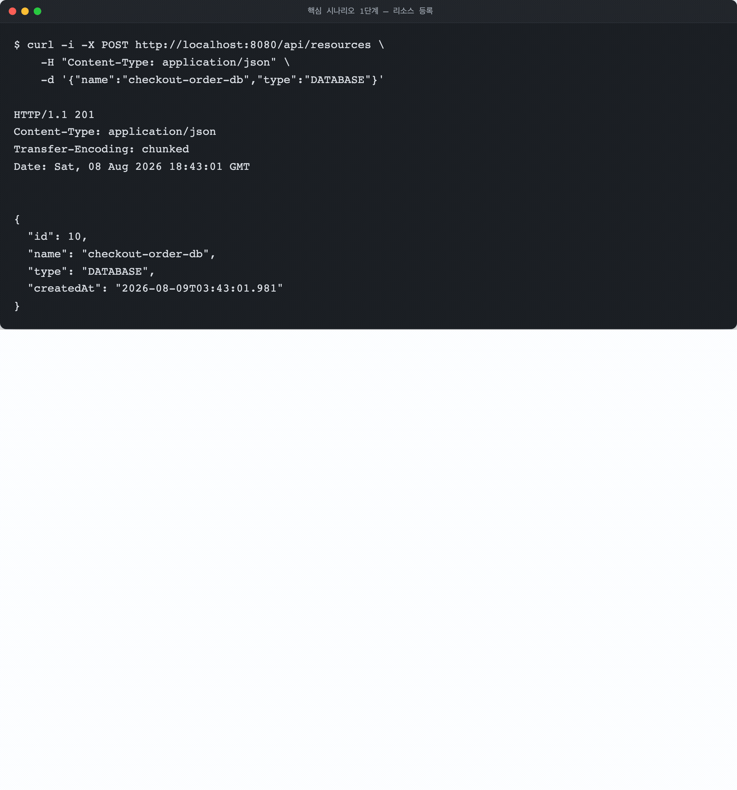
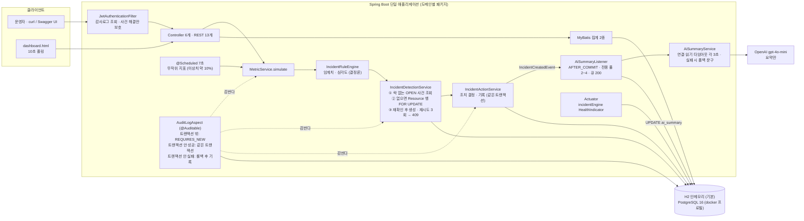

# Ops Sentinel — 지표 이상을 규칙엔진으로 판정해 사건·조치·감사로그를 남기는 Spring Boot API

> 가상 인프라 지표가 임계치를 넘으면 규칙엔진이 심각도와 조치를 정하고, 같은 리소스에 사건이 중복으로 생기지 않게 비관적 락으로 막으며, 모든 판단을 AOP 감사로그로 남기는 백엔드다. LLM(OpenAI gpt-4o-mini)은 이미 내려진 판단을 1~2문장으로 요약할 뿐 판단에 관여하지 않는다.

[](https://github.com/jang961111-hash/ops-sentinel/actions/workflows/ci.yml)   

**데모**: 배포본 없음 (로컬 실행 → [실행 방법](#실행-방법)) · **기간**: 2026.08.08 22:38 – 08.09 07:20 (약 8시간 15분, 제출 2026-08-09) → 사후 재측정·보완 2026.09.28 · **팀**: 개인 (커밋 작성자 1명) · **맥락**: SKALA 4기 백엔드 최종 실습(개인 과제)

**스택**: Java 21 · Spring Boot 3.3.4 · Spring Data JPA + MyBatis · H2(기본) / PostgreSQL 16(Docker Compose) · Spring AOP · jjwt · springdoc-openapi · OpenAI Chat Completions(`RestClient`) · JUnit 5 · JaCoCo · GitHub Actions



## 먼저 읽기: 어떻게 만들었고, 무엇이 사실인가

- **코드는 AI 코딩 에이전트가 작성했다.** Claude Code를 Ralph 루프(같은 지시를 완료될 때까지 자율 반복 실행)로 돌려 약 8시간 15분 동안 이슈 17개·PR 30개(전부 머지)를 만들었다. 커밋은 모두 내 계정이다. 에이전트에 넘긴 실행 지시문 원문은 [`docs/CLAUDE_CODE_마스터프롬프트.md`](docs/CLAUDE_CODE_마스터프롬프트.md)에 그대로 두었다.
- **제출 당시 README의 "감사로그 100% 기록"은 사실이 아니었다.** 2026-09 재측정에서 AI 응답 지연 3초를 넣고 같은 리소스에 동시 150건을 보내자 감사로그가 38~39%만 남았고 실패 기록은 0건이었다. AI 지연이 없을 때도 3라운드 중 1라운드에서 409 91건·FAIL 감사 0건이 나왔는데, 제출 당시 CHANGELOG의 150건 기록과 숫자까지 같다.
- **제출 당시 "커넥션 풀 30→60 증설로 해결"은 증상 완화였다.** 원인은 락 안의 AI 호출, 락 안 감사로그(REQUIRES_NEW)의 커넥션 교착, OSIV가 쥔 닫힌 커넥션 재사용이었다. 구조를 고친 뒤([PR #48](https://github.com/jang961111-hash/ops-sentinel/pull/48), 머지 전) 풀을 기본값 10으로 되돌려도 같은 리소스 동시 150건에서 201 450/450, 감사 450/450이다.
- 판단 로직에 LLM이 끼지 않는다는 주장은 코드상 사실이다. 심각도·조치는 `IncidentRuleEngine`과 `IncidentActionService`의 분기가 정하고, LLM 결과는 `aiSummary` 필드에만 들어간다. 단 LLM은 지표 수치를 받지 않으므로 요약은 이미 정해진 라벨을 문장으로 옮기는 수준이다.

## 핵심 수치

모두 **2026-09-28 재측정**이다. 환경: Apple M5 16GB · Temurin 21.0.11 · 기본 프로필 H2 인메모리 · 단일 JVM. 부하 측정은 레포 밖 측정 스크립트(asyncio + aiohttp)와 OpenAI 목 서버(HTTPS 프록시, 지연 주입)로 했고 실제 OpenAI는 한 번도 호출하지 않았다. 값은 3라운드 중앙값, 응답코드·감사 건수는 3라운드 합이다.

| 지표 | 수정 전 (`b6b8709`, 제출본) | 수정 후 (PR #48) | 측정 조건 |
|---|---|---|---|
| 같은 리소스 동시 150건, **풀 10** | 201 24 / 409 54 / **500 372**, p95 30.19s, 감사 성공 24 + 실패 372 | **201 450/450**, p95 0.11s, **감사 450/450** | AI 응답 지연 3s 주입, 수정 후 커밋 `1f2fc44` |
| 같은 리소스 동시 150건, 풀 60 (제출 당시 설정) | 201 172 / 409 278, p95 21.29s, **감사 172/450 (38.2%)**, FAIL 감사 0 | 201 450, p95 0.13s, 감사 450/450 | AI 지연 3s |
| AI 지연이 사건 생성 요청을 붙잡는 정도 | 같은 리소스 20건 전부 **p95 3.05s, 6.6 rps** | **p95 0.05s, 381.9 rps** | N=20, 풀 30, AI 지연 3s |
| 테스트 | 46/46 | **56/56** (실패·스킵 0) | `./gradlew clean test`, 커밋 `3f5b598` |
| 커버리지 (JaCoCo) | 라인 70.0% · 브랜치 69.9% | **라인 80.0% (453/566) · 브랜치 77.3% (116/150)** | 같은 명령, 커밋 `3f5b598` |
| 조회·쓰기 API 지연 (경합 없음) | 동시성 10: p50 0.6~2.7ms / p95 1.0~5.3ms · 동시성 50: p95 4.2~18.3ms, 오류 0 | (미측정) | 조회 7종 + 지표 쓰기 1종, 엔드포인트당 300건×2, `b6b8709` |
| 클론 → 빌드 | `git clone` 4.1s → `./gradlew build` 11.0s (테스트 포함), 기동 후 health 응답 약 3~4s | — | Gradle 배포판·의존성 캐시가 있는 상태 |

- 전후 비교 전체 표와 풀 10 실패 양상(Hikari `connectionTimeout` 30s)은 [docs/TROUBLESHOOTING.md](docs/TROUBLESHOOTING.md#1-커넥션-풀-고갈--풀-증설은-문턱만-옮겼다)에 있다.
- 한계: H2 인메모리 조건이다. PostgreSQL 프로필(Docker Compose)에서는 부하를 재지 않았다. 수정 후 Hikari active가 0으로 잡힌 것은 100ms 폴링보다 버스트가 빨리 끝나서이며, "커넥션을 안 썼다"는 뜻이 아니다.

## 내가 한 일

모든 커밋이 내 계정이다. 코드 작성은 Claude Code가 했다. 아래는 근거가 레포에 남아 있는 내 몫이다.

- **주제와 범위 설정 (2026-08-08)**: SK AX×대신증권 에이전틱 AIOps 사례(2026.4 보도)의 "지표 감시 → 이상 탐지 → 판단 → 조치 → 감사"를 개인 과제 규모로 줄였다. "판단은 규칙엔진, LLM은 설명만", MSA·클라우드 배포 제외, H2 기본 + Compose 선택 실행을 기획서에 정했다 — [`docs/01_PRD_기획명세서_최종본.md`](docs/01_PRD_기획명세서_최종본.md)(작성자 표기 본인), [`docs/07_배경조사_근거자료집.md`](docs/07_배경조사_근거자료집.md).
- **AI 에이전트 실행과 검증 구조 (2026-08-08~09)**: 실행 지시문을 넘겨 Ralph 루프를 돌렸고, 결과를 두 번 따로 검증하게 했다. ① 별도 리뷰 에이전트 검증에서 REJECTED(결함 C1~C5) → 재현 후 수정 → 재검증 APPROVED ② 사전지식 없는 에이전트가 제출 zip을 풀어 서버를 띄우는 "콜드스타트 채점"에서 동시 40건 중 29건 500 결함 발견 → 수정. 기록은 [`CHANGELOG.md`](CHANGELOG.md) `[1.0.1]`·`[1.0.2]`.
- **사후 재측정과 구조 수정 (2026-09-28)**: 제출 README의 수치 주장을 전부 다시 재도록 했고, 반증된 주장(감사 100%, 풀 증설로 해결, 타임아웃 3초)을 그대로 공개하기로 했다. 재측정·수정 작업도 Claude Code로 했다. 결함마다 재현 테스트를 먼저 커밋해 수정 전 실패를 확인한 뒤 고쳤고, 독립 리뷰 에이전트의 MED 지적 3건과 재검토 지적 2건을 추가 커밋으로 반영했다 — [PR #48](https://github.com/jang961111-hash/ops-sentinel/pull/48).
- **문서·위생 (2026-09-28, 이 PR)**: README를 코드와 대조해 다시 쓰고(불일치 13건 정정), 트러블슈팅·회고를 추가했다. MIT LICENSE를 추가하고, 공개 레포에 있던 교육과정 내부 정보(강사 실명·공지 인용·교육생 고유번호가 적힌 제출 PDF)와 제3자 뉴스룸 캡처를 현재 트리에서 뺐다.

## 아키텍처


```mermaid
flowchart LR
  subgraph Clients["클라이언트"]
    OP["운영자 · curl / Swagger UI"]
    DASH["dashboard.html<br/>10초 폴링"]
  end

  subgraph App["Spring Boot 단일 애플리케이션 (도메인별 패키지)"]
    JWT["JwtAuthenticationFilter<br/>감사로그 조회 · 사건 해결만 보호"]
    CTRL["Controller 6개 · REST 13개"]
    SCHED["@Scheduled 7초<br/>무작위 지표 (이상치 약 10%)"]
    MET["MetricService.simulate"]
    RULE["IncidentRuleEngine<br/>임계치 · 심각도 (결정론)"]
    DET["IncidentDetectionService<br/>① 락 없는 OPEN 사건 조회<br/>② 없으면 Resource 행 FOR UPDATE<br/>③ 재확인 후 생성 · 재시도 3회 → 409"]
    ACT["IncidentActionService<br/>조치 결정 · 기록 (같은 트랜잭션)"]
    LSN["AiSummaryListener<br/>AFTER_COMMIT · 전용 풀 2~4 · 큐 200"]
    AIS["AiSummaryService<br/>연결·읽기 타임아웃 각 3초 · 실패 시 폴백 문구"]
    AUD["AuditLogAspect (@Auditable)<br/>트랜잭션 밖: REQUIRES_NEW<br/>트랜잭션 안 성공: 같은 트랜잭션<br/>트랜잭션 안 실패: 롤백 후 기록"]
    MB["MyBatis 집계 2종"]
    HI["Actuator<br/>incidentEngine HealthIndicator"]
  end

  DB[("H2 인메모리 (기본)<br/>PostgreSQL 16 (docker 프로필)")]
  LLM["OpenAI gpt-4o-mini<br/>요약만"]

  OP --> JWT --> CTRL
  DASH --> CTRL
  CTRL --> MET
  SCHED --> MET
  MET --> RULE --> DET --> ACT
  ACT -- "IncidentCreatedEvent" --> LSN
  LSN --> AIS --> LLM
  LSN -- "UPDATE ai_summary" --> DB
  DET --> DB
  ACT --> DB
  AUD -. "감싼다" .-> MET
  AUD -. "감싼다" .-> DET
  AUD -. "감싼다" .-> ACT
  AUD --> DB
  CTRL --> MB --> DB
  HI --> DB
```

요청 하나의 흐름:

1. `POST /api/metrics/simulate`(또는 7초 스케줄러)가 지표를 저장하고 `IncidentRuleEngine`이 임계치를 검사한다(에러율 ≥5%, CPU·메모리 ≥90%, 큐 길이 ≥50).
2. 이상이면 먼저 락 없이 그 리소스의 OPEN 사건을 찾는다. 있으면 바로 돌려준다. 없을 때만 `Resource` 행에 `SELECT … FOR UPDATE`를 걸고 다시 확인한 뒤 사건을 만든다.
3. 같은 트랜잭션에서 조치(MONITOR/ALERT/RESTART/BACKUP/ESCALATE 조합)를 기록하고, `aiSummary`에는 폴백 문구를 먼저 넣은 채 커밋한다. 락은 여기서 풀린다.
4. 커밋 뒤 `AiSummaryListener`가 전용 스레드 풀에서 OpenAI를 불러 요약을 `UPDATE`로 바꿔 쓴다. 키가 없거나 실패하면 폴백 문구가 남는다.
5. `@Auditable`이 붙은 4개 메서드(`simulate`, `detectAndCreate`, `decideAndRecord`, `resolve`)의 성공·실패가 `audit_log`에 남는다. 스케줄러의 지표 생성은 감사 대상이 아니다.

ERD는 [`docs/images/erd.png`](docs/images/erd.png)(엔티티 5개: Resource, MetricSnapshot, Incident, IncidentAction, AuditLog), API 상세는 [`docs/02_API_기능명세서.md`](docs/02_API_기능명세서.md)와 Swagger UI에 있다.

## 기술적 결정

| 결정 | 대안 | 선택 이유 | 대가(trade-off) |
|---|---|---|---|
| 판단은 규칙엔진, LLM은 사후 요약만 | LLM이 심각도·조치 결정 | 판단을 결정론적으로 재현·테스트하기 위해 | 요약 프롬프트에 지표 수치가 없어 "왜"를 새로 설명하지 못한다 |
| `Resource` 행 비관적 락 + 락 없는 사전 조회(double-checked) | `Incident.version` 낙관적 락, 부분 유니크 인덱스 | 낙관적 락은 새 행 두 개의 동시 insert를 막지 못하고, H2는 부분 유니크 인덱스가 없다 | 같은 리소스 첫 사건 생성은 직렬화된다. 락 타임아웃 10초, 재시도 backoff 없음 |
| AI 요약을 커밋 후 비동기로 (PR #48) | 락 안에서 동기 호출 (제출본) | AI 응답 시간이 락 보유 시간이 되지 않게 하려고 | 생성 직후 조회하면 폴백 문구가 보인다. 큐(200) 초과나 종료 10초 초과분은 요약 없이 폴백으로 남는다 |
| 감사 기록을 트랜잭션 위치에 따라 분기 (PR #48) | 모든 감사를 REQUIRES_NEW | 락 안에서 커넥션을 하나 더 빌리면 대기자가 풀을 다 쥐었을 때 교착이 생겼다 | **롤백된 트랜잭션의 성공 기록은 남지 않는다.** 그 요청의 실패는 트랜잭션 밖 어드바이스가 기록한다 |
| OSIV 끔 (PR #48) | Spring Boot 기본값(켜짐) | 요청마다 커넥션을 응답 끝까지 쥐고, 락 타임아웃으로 폐기된 커넥션을 같은 요청의 재시도·감사가 다시 썼다 | 컨트롤러에서 지연 로딩을 못 쓴다. 사건 상세는 fetch join으로 읽는다 |
| JPA(CRUD·락) + MyBatis(집계) | 전부 JPQL | 다중 테이블 집계를 SQL로 드러내기 위해 | H2 전용 함수가 PostgreSQL에서 깨진 적이 있다(C4). 테스트는 H2에서만 돈다 |
| jjwt + `OncePerRequestFilter`로 두 경로만 보호 | Spring Security | 계정·역할 체계가 없는 규모라서 | admin 계정 하나, 기본 비밀번호 `admin1234`, secret 미설정 시 재기동마다 토큰 무효 |

## 트러블슈팅 (요약 → 상세는 [docs/TROUBLESHOOTING.md](docs/TROUBLESHOOTING.md))

- **커넥션 풀 고갈** → 제출 당시 풀 30→60 증설(증상 완화) → 2026-09 재측정으로 락 안 AI 호출·락 안 REQUIRES_NEW 교착·OSIV 닫힌 커넥션 재사용을 분리해 확인 → 구조 수정 (풀 10·동시 150건: 500 372건 → 0건, 201 450/450)
- **"감사로그 100%"가 거짓이었다** → 409로 끝난 요청은 성공·실패 기록이 모두 없었다 → OSIV 끔 + 트랜잭션 위치별 감사 분기 + errorMessage 2000자 절삭 (동시 150건 감사 38.2% → 100%)
- **CI(Linux)에서만 실패한 해결 시각 테스트** → Linux JVM은 나노초, H2 TIMESTAMP는 마이크로초 → 운영 코드에서 마이크로초로 절삭 (CI 1차 실패 → 통과)
- **리뷰가 잡은 비동기 요약 덮어쓰기와 500** → 전체 컬럼 UPDATE가 요약을 폴백으로 되돌림, rollback-only 커밋이 재시도 목록 밖 → `@DynamicUpdate`, `UnexpectedRollbackException` 재시도 (재현 테스트 실패 → 통과)
- **감사로그가 존재하지 않는 사건을 가리킴 (2026-08)** → `Optional.empty()`일 때 인자의 지표 id를 사건 id로 기록 → Optional을 그대로 존중 (전용 회귀 테스트는 아직 없음)

## 실행 방법

사전 요구: JDK 21. DB 설치는 필요 없다(H2 인메모리).

```bash
git clone https://github.com/jang961111-hash/ops-sentinel.git
cd ops-sentinel
./gradlew bootRun        # http://localhost:8080
```

| 주소 | 용도 |
|---|---|
| `/swagger-ui/index.html` | 전체 API 문서·호출 |
| `/dashboard.html` | 최근 사건·리소스 위험도 랭킹 (인증 없음) |
| `/actuator/health` | 헬스체크. 최근 5분 안에 미해결 CRITICAL 사건이 있으면 `incidentEngine`이 DOWN |
| `/h2-console` | JDBC URL `jdbc:h2:mem:opssentinel`, 사용자 `sa`, 비밀번호 없음 |

빠른 시나리오 (기동 시 예시 리소스 8개가 자동 등록되므로 새 리소스 id는 9부터다. 2026-09-28 이 순서로 실행해 확인했다):

```bash
curl -s -X POST localhost:8080/api/resources -H 'Content-Type: application/json' \
  -d '{"name":"api-1","type":"API"}'                         # → {"id":9,...}
curl -s -X POST localhost:8080/api/metrics/simulate -H 'Content-Type: application/json' \
  -d '{"resourceId":9,"errorRate":25}'                       # 에러율 25% → CRITICAL 사건
curl -s 'localhost:8080/api/incidents?resourceId=9'          # 사건 id 확인
curl -s localhost:8080/api/incidents/<사건 id>               # 조치 이력(ESCALATE, ALERT) + aiSummary
TOKEN=$(curl -s -X POST localhost:8080/api/auth/token -H 'Content-Type: application/json' \
  -d '{"username":"admin","password":"admin1234"}' | python3 -c 'import sys,json;print(json.load(sys.stdin)["accessToken"])')
curl -s localhost:8080/api/audit-logs -H "Authorization: Bearer $TOKEN"
```

테스트 (OpenAI를 호출하지 않는다. `build.gradle`이 테스트 JVM의 `OPENAI_API_KEY`를 빈 값으로 고정하고, AI 지연 테스트는 JDK `HttpServer`로 만든 가짜 서버를 쓴다):

```bash
./gradlew clean test     # 56건, JaCoCo 리포트: build/reports/jacoco/test/html/index.html
```

선택 사항:

| 환경변수 | 기본값 | 역할 |
|---|---|---|
| `OPENAI_API_KEY` | 없음 | 있으면 사건마다 요약 1회 호출. 없으면 폴백 문구 |
| `OPENAI_BASE_URL` | `https://api.openai.com/v1` | 호환 공급자·프록시·테스트용 |
| `OPENAI_TIMEOUT_MS` | 3000 | 연결·읽기 각각에 적용(최악 약 6초) |
| `ADMIN_PASSWORD` | `admin1234` | 관리자 토큰 발급용. 데모 기본값이므로 공개 환경에서는 반드시 바꾼다 |
| `JWT_SECRET` | 없음 | 없으면 기동마다 랜덤 키 |

Docker Compose(app + PostgreSQL 16):

```bash
cp .env.example .env     # DB_PASSWORD 등 채우기
docker compose up -d --build
```

- 2026-08-09 당시 기동과 `/actuator/health`의 `db=PostgreSQL`, `incidentEngine=UP`을 확인했다. 2026-09 재측정에서는 Compose를 실행하지 않았다.
- Compose가 5432 포트를 호스트에 바인딩한다. 로컬에 PostgreSQL이 떠 있으면 기동이 실패한다.

## 알려진 한계

- 시뮬레이션 지표만 다룬다. 실제 인프라 수집기는 없다.
- 스케줄러를 설정으로 끌 수 없다. 키를 넣고 띄워 두면 리소스마다 7초 주기로 이상치가 생겨 요약 호출(과금)이 계속된다.
- 락 타임아웃 10초, 재시도 3회에 backoff가 없다. 같은 리소스에 경합이 길어지면 409로 끝난다.
- 테스트와 부하 측정은 H2에서만 했다. PostgreSQL 방언 차이는 CI가 잡지 못한다(Testcontainers 없음).
- 보안 기본값은 데모용이다: `admin1234`, 인증 없는 `/h2-console`, `show-sql: true`, `ddl-auto: update`, Compose의 5432 노출.

## 문서

| 문서 | 내용 |
|---|---|
| [docs/TROUBLESHOOTING.md](docs/TROUBLESHOOTING.md) | 트러블슈팅 5건 상세 (측정 조건·커밋 포함) |
| [docs/RETROSPECTIVE.md](docs/RETROSPECTIVE.md) | 회고 (KPT, 다시 만든다면, 사후 보완 내역) |
| [CHANGELOG.md](CHANGELOG.md) | 2026-08-09 당시 기록. 당시 표현("100% 달성", "완전히 해결")을 고치지 않고 남겼다. 이 README와 다르면 이 README가 2026-09 재측정 기준이다 |
| [docs/01_PRD_기획명세서_최종본.md](docs/01_PRD_기획명세서_최종본.md) · [docs/02_API_기능명세서.md](docs/02_API_기능명세서.md) | 기획·API 명세 (2026-08-08) |
| [docs/07_배경조사_근거자료집.md](docs/07_배경조사_근거자료집.md) | SK AX×대신증권 사례, Google SRE, FINOS 등 배경 근거 |
| [docs/CLAUDE_CODE_마스터프롬프트.md](docs/CLAUDE_CODE_마스터프롬프트.md) · [docs/08_최종PDF_생성_프롬프트.md](docs/08_최종PDF_생성_프롬프트.md) | AI 에이전트에 넘긴 개발·보고서 생성 지시문 원문 |
| `docs/pdf/captures/` | 제출 보고서에 쓴 캡처 PNG 28장과 원본 텍스트 로그. 제출 PDF 자체는 교육생 식별정보가 있어 공개 저장소에서 뺐다 |

## 회고

- 8시간 자율 실행으로 스토리 25개와 테스트 46건을 채웠지만, 부하에서만 드러나는 결함은 테스트가 잡지 못했다. 테스트는 AI 호출 경로를 타지 않았고, 40건 동시성 테스트는 감사 건수를 검사하지 않았다.
- 가장 크게 배운 것은 "증상이 사라졌다"와 "원인을 없앴다"가 다르다는 점이다. 풀 증설은 문턱을 40건에서 150건 사이로 옮겼을 뿐이다.
- 사후 보완은 재현 테스트 → 수정 → 재측정 → PR 순서로 쌓았다. 상세는 [docs/RETROSPECTIVE.md](docs/RETROSPECTIVE.md).

## 라이선스

[MIT](LICENSE) © 2026 Byeongheon Jang
